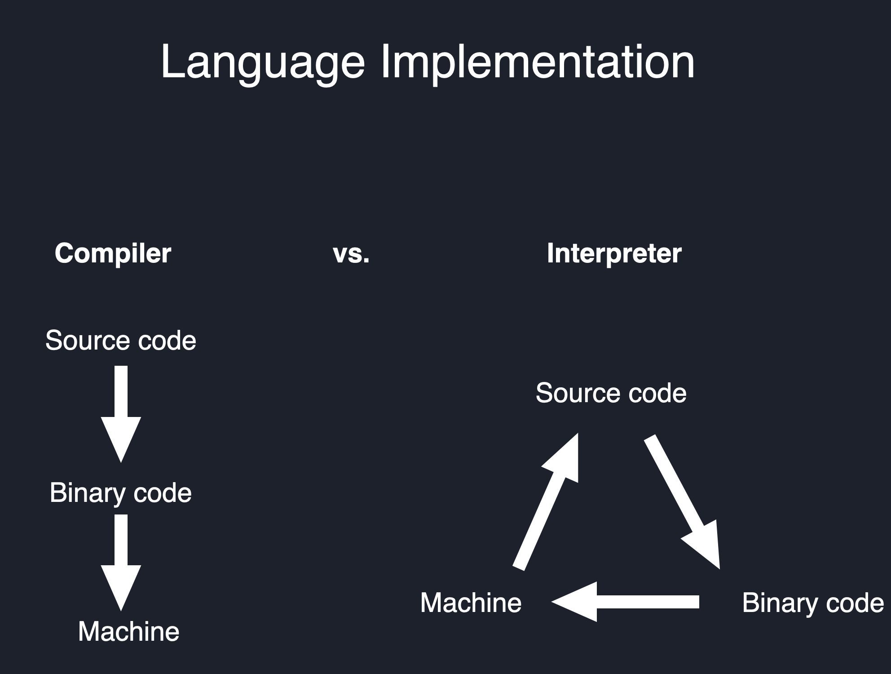

# Compiled vs Interpreted Languages

Compiled languages and interpreted languages are two different types of programming languages that differ in their approach to generating machine code from the source code.

## Compiled Languages
A compiled language is a programming language whose source code is translated into machine code (binary code) <strong>before</strong> execution. 

This machine code can then be run directly by the operating system on the target computer.

<strong>
Examples of compiled languages include C, C++, Java, and Go.
</strong>

In compiled languages, the source code is first compiled into an executable file, which can then be executed on the target machine. 

The compiler performs various optimizations on the code, which can result in faster execution times. 

Compiled languages are often used for developing system-level software, such as:

- Device drivers (e.g. printer drivers)
- Operating systems (e.g. Windows, Linux, Mac OS X)
- Applications that require high performance (e.g. video games)

#### Advantages of compiled languages:

1. Faster execution times due to machine code optimization.
2. Better performance for system-level software.
3. Better memory management and more control over system resources.

#### Disadvantages of compiled languages:

1. Longer development times due to the need for compilation.

2. Code is not as portable across different platforms.
For example, a program compiled for Windows cannot be run on Linux or Mac OS X without recompilation.

3. More difficult debugging due to the lower-level nature of the language.

## Interpreted Languages

An interpreted language is a programming language whose source code is executed directly without the need for a compilation step. 

<strong>
Examples of interpreted languages include Python, Ruby, and JavaScript.
</strong>

In interpreted languages, the source code is executed line by line by the interpreter. The interpreter translates each line of code into machine code at runtime, which can result in slower execution times compared to compiled languages. 

However, interpreted languages offer several advantages, including faster development times, easier debugging, and the ability to run code on any platform without the need for recompilation.

#### Advantages of interpreted languages:

* Faster development times due to the lack of compilation.
* More portable code that can run on any platform.
* Easier debugging due to the higher-level nature of the language.

#### Disadvantages of interpreted languages:

* Slower execution times due to the need for interpretation.
* Limited control over system resources.
* May require additional libraries or interpreters to run.

## Diagram of compiled vs interpreted languages

