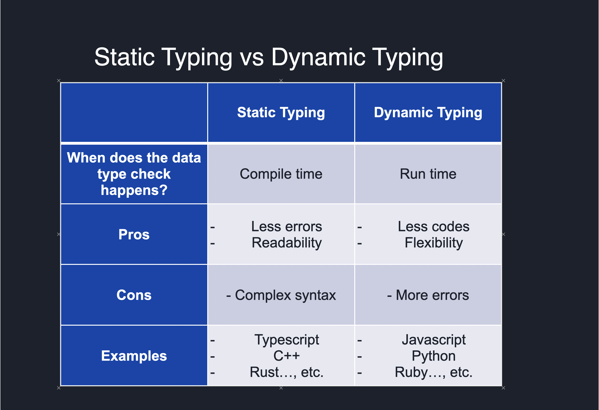

## Static Typing:

Static typing requires that variable types be declared explicitly at compile time. This means that the compiler can check for type errors before the code is run, which can help catch bugs early on. Here are some popular programming languages that use static typing:

- C
- C++
- Java
- Python (with type hints)
- TypeScript

#### Pros:

1. Catching errors at compile time: With static typing, the compiler can catch type errors before the code is run. This can help prevent errors from occurring in the first place. For example, 

in Java:
```java
Copy code
int x = "hello"; // Error: incompatible types
```

2. Improved code readability and documentation: Because variable types are declared explicitly, it can make code easier to read and understand. For example, in Python with type hints:

```python
def calculate_area(length: float, width: float) -> float:
    return length * width
```
3. Improved performance: Static typing can often result in faster code execution, since the compiler can optimize code based on the declared types. For example, in C++:
```cpp
int x = 10;
int y = 20;
int z = x + y; // Faster execution, since the types are known at compile time
```

#### Cons:

1. More verbose code: Static typing requires that variable types be declared explicitly, which can make code more verbose and harder to write. 
For example, in Java:
```java
String message = "Hello, world!";
```

2. Slower development time: Because static typing requires more time and effort to declare variable types, it can slow down development time, especially in the early stages of a project where rapid prototyping is important. 

For example, in TypeScript:
```typescript
interface Person {
  name: string;
  age: number;
  address: string;
}

let john: Person = {
  name: 'John',
  age: 30,
  address: '123 Main St'
};
```

3. More rigid: Static typing can make code more rigid and less flexible, since it requires that variables be declared with specific types. 
For example, in Java:
```java
int[] numbers = new int[10]; // Array size is fixed at 10
```


## Dynamic Typing:

Dynamic typing allows variables to have different types at different times during the program execution. This means that type checking is done at runtime, which can be slower but also more flexible. 
Here are some popular programming languages that use dynamic typing:

- JavaScript
- Python
- Ruby
- PHP
- Perl

#### Pros:

1. Faster development time: Dynamic typing can speed up development time, since it doesn't require developers to declare variable types explicitly. 
For example, in Python:

```python
message = "Hello, world!"
```

2. More flexible: Dynamic typing allows for more flexibility in programming, since it doesn't restrict the type of data that can be assigned to a variable. 

For example, in JavaScript:
```javascript
let x = 10; // Number
x = "hello"; // String
```

Easier prototyping: Dynamic typing can be particularly helpful during the prototyping phase, when developers are experimenting with different ideas and want to be able to make changes quickly. 

For example, in Ruby:
```ruby
def greet(name)
  puts "Hello, #{name}!"
end

greet("John") # Output: Hello, John!
greet(123) # Output: Hello, 123!
```


#### Cons:
1. Run-time errors: Because type checking is done at run-time with dynamic typing, errors may not be caught until the program is actually running, which can lead to unexpected behavior or errors. 

For example, in JavaScript:
```javascript
let x = 10;
let y = "20";
let z = x + y; // Result is "1020", which may not be the intended result
```

2. Harder to maintain: Dynamic typing can make code harder to maintain over time, since the lack of explicit type declarations can make it harder to understand what a piece of code is doing. 

For example, in PHP:
```php
function add_numbers($x, $y) {
  return $x + $y;
}

echo add_numbers(10, 20); // Output: 30
echo add_numbers("10", "20"); // Output: 30
```

3. Slower performance: Dynamic typing can be slower than static typing, since the program has to perform type checks at run-time, which can slow down the program execution. 

For example, in Python:
```python
def add_numbers(x, y):
    return x + y

print(add_numbers(10, 20)) # Output: 30
print(add_numbers("10", "20")) # Output: "1020"
```

### Diagram of Static vs Dynamic Typing:

