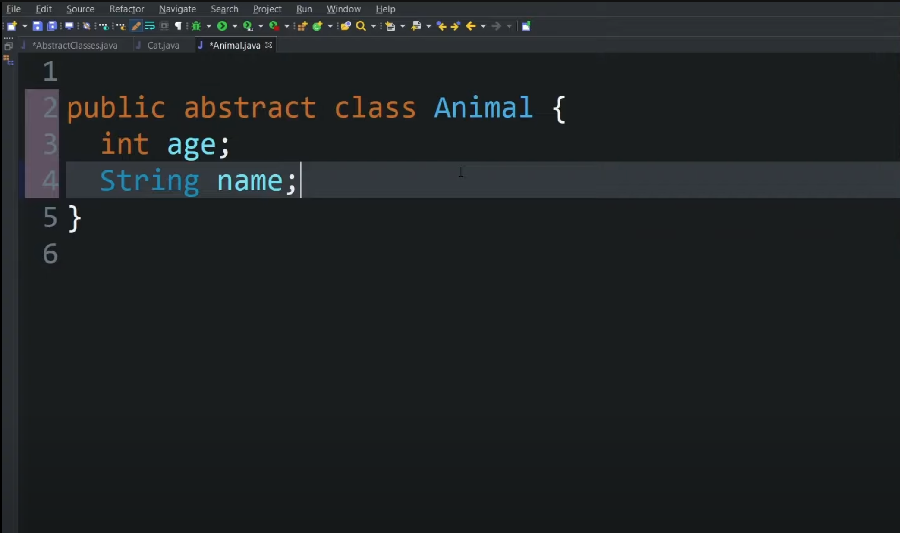
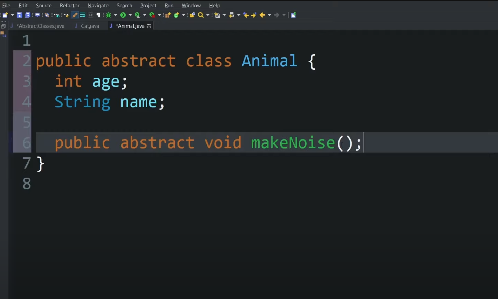
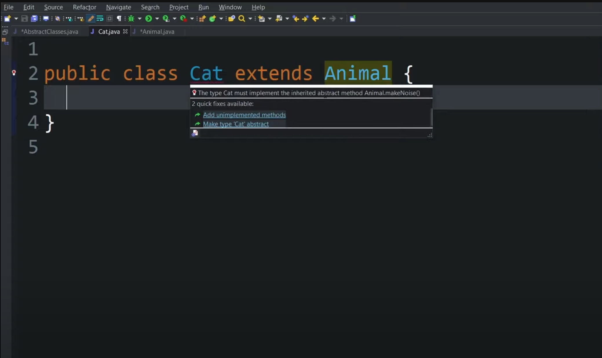
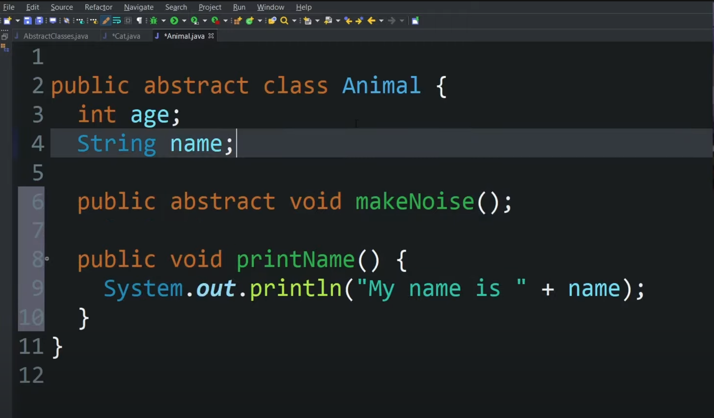
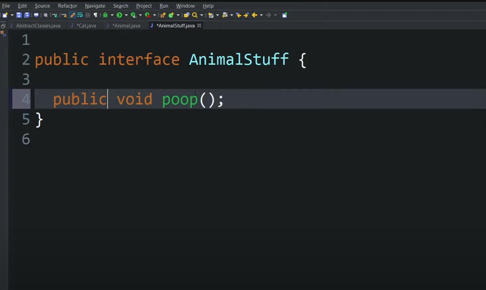
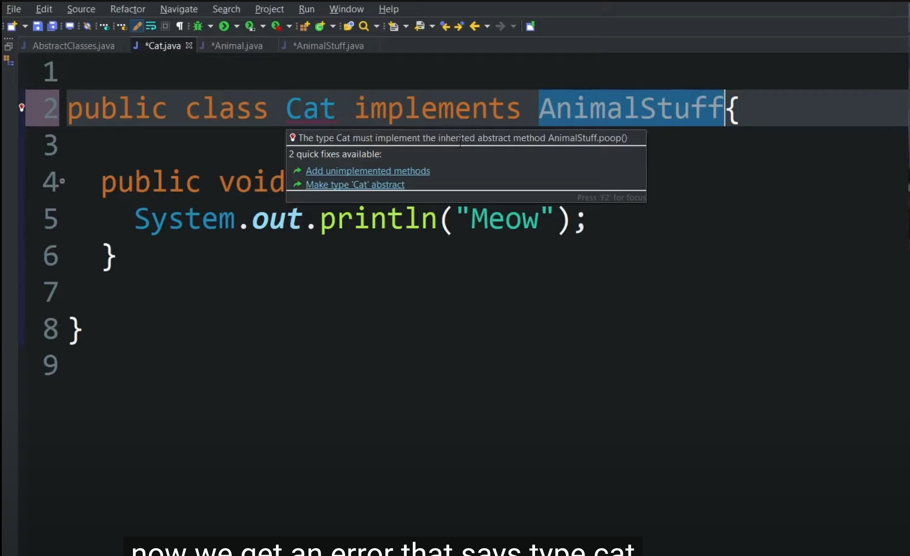
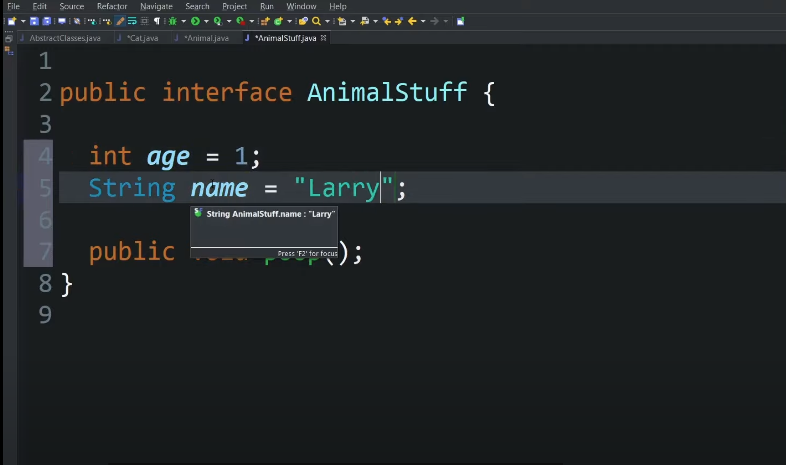
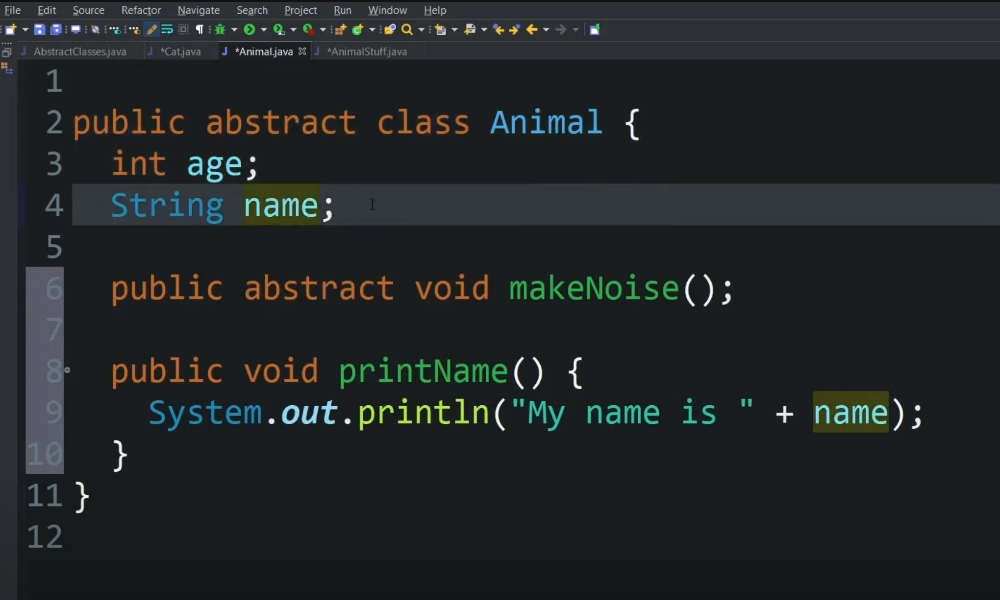

# Abstraction

Abstraction is the process of hiding complex implementation details and showing only the necessary information to the user. 
It is a fundamental concept in object-oriented programming that allows programmers to create more maintainable and flexible code.

In Java, abstraction is often achieved through the use of abstract classes and interfaces. 

#### Abstract classes vs interfaces
`Abstract classes` are classes that cannot be instantiated and are often used as base classes for other classes. 

`Interfaces`, on the other hand, are similar to abstract classes but do not have any implementation details at all. Instead, they define a set of methods that must be implemented by any class that implements the interface.

Here's an example of abstraction using an abstract class in Java:

### 1. Making abstract class

### 2. Making abstract method

### 3. Cat class must implement makeNoise() method

### 4. PrintName() is a method in the  abstract class but not forced to implement because it is not an abstract method

# Differences between abstrct class and interface

### 1. Making AnimalStuff interface with a method poop()

### 2. Cat class must implement poop() method

### 3. In interface every field is public, static, and FINAL

### 4. In abstract class, no need for predefined fields

### Conclusion
In summary, abstract classes and interfaces are both used to achieve abstraction in Java. 

`Abstract classes` are used when you want to provide a base class that cannot be instantiated and must be extended by other classes. 

Interfaces, on the other hand, are used when you want to define a set of methods that must be implemented by any class that implements the interface.