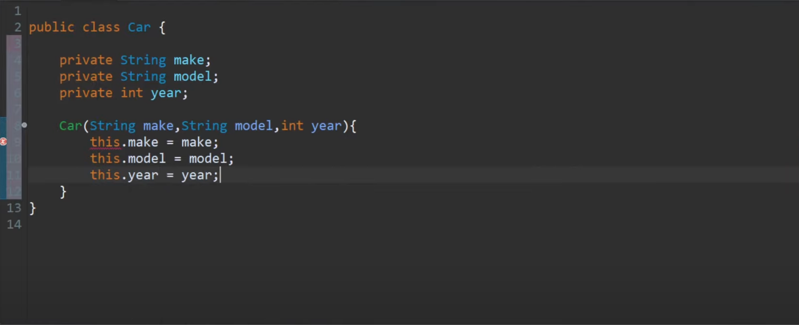
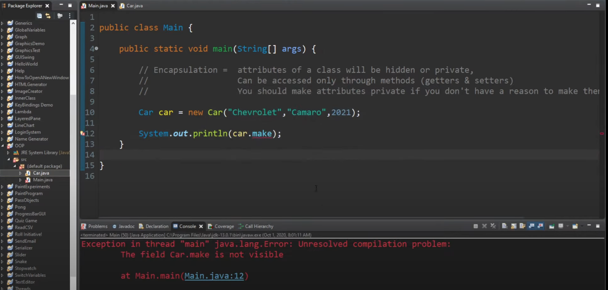
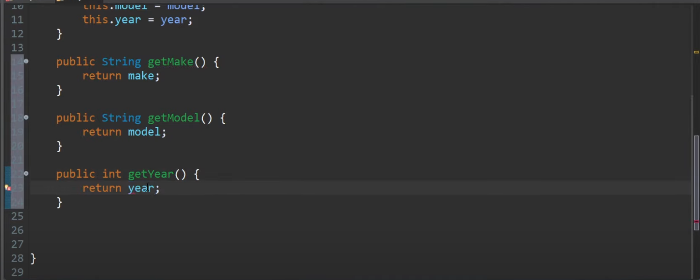
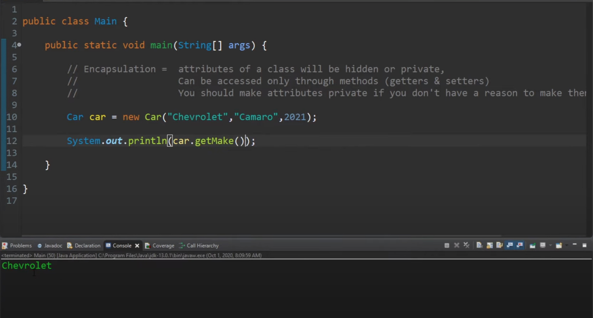
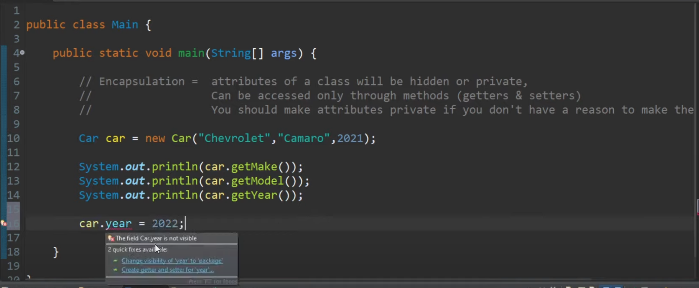
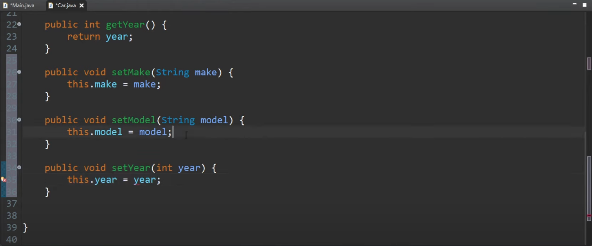
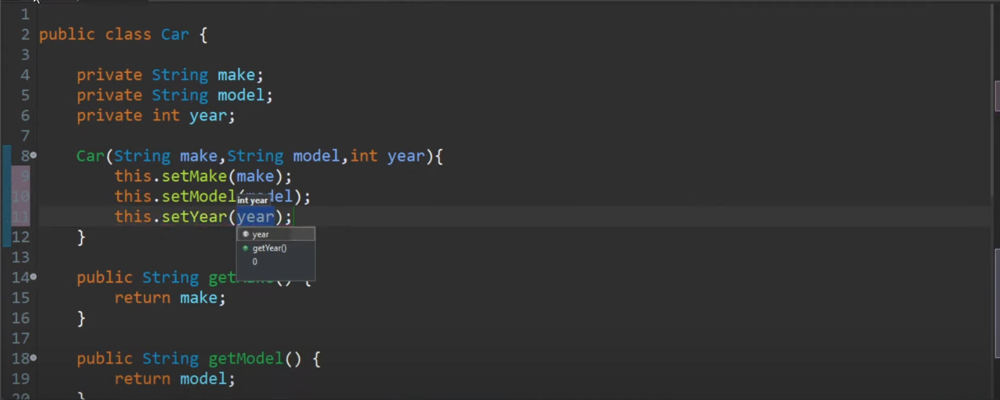
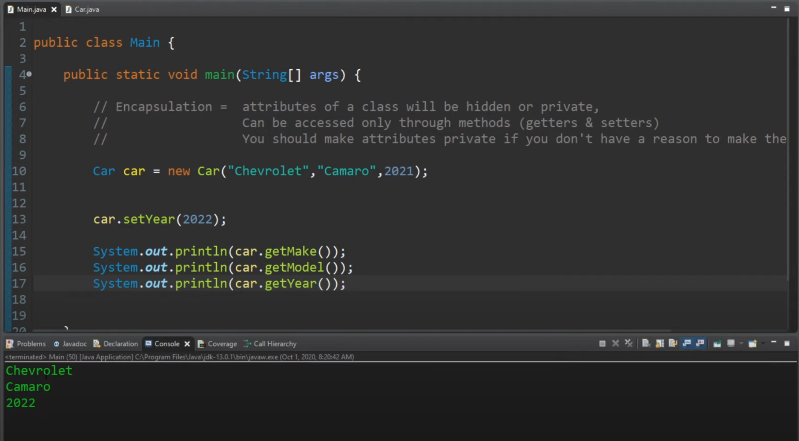

# Encapsulation

The purpose of encapsulation is to create a protective barrier around the data, such that it can only be accessed and manipulated through the methods provided by the class.

In other words, encapsulation helps to enforce the idea of "data hiding", which means that the internal details of the class are hidden from the outside world, and can only be accessed through a well-defined interface of methods. 

This helps to prevent accidental modification of the data, and allows the class to maintain its internal consistency and validity.

# Example
In this example, we have a Car class that has three private fields: make, model, and year.

We also have three getter methods for each field, and three setter methods for each field.

The getter methods allow us to access the values of the fields. 

The setter methods allow us to change the values of the fields.

### 1. Car class with private fields

### 2. Cannot print car make field

### 3. Creating getter methods for each field

### 4. Printing make of car successful with getMake()

### 5. Cannot change the car year directly

### 6. Creating setter method for each field

### 7. Calling all three setters in the constructor

### 8. Setting the year was successful

<strong>NOTE:</strong>
- In a real world use case, we would probably want to add some validation logic to the setter methods to ensure that the values being set are valid.

## Conclusion

In conclusion, encapsulation is a fundamental concept in object-oriented programming that refers to the practice of bundling data and methods that operate on that data into a class. 

The purpose of encapsulation is to create a protective barrier around the data, such that it can only be accessed and manipulated through the methods provided by the class.