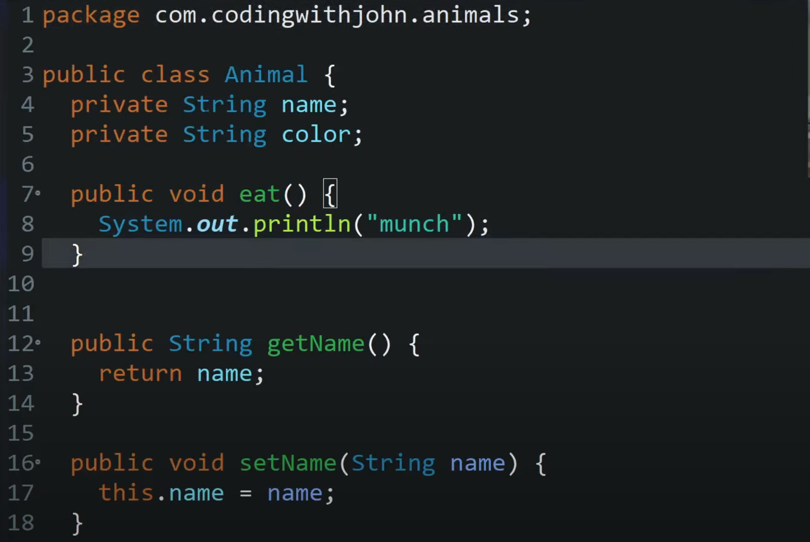
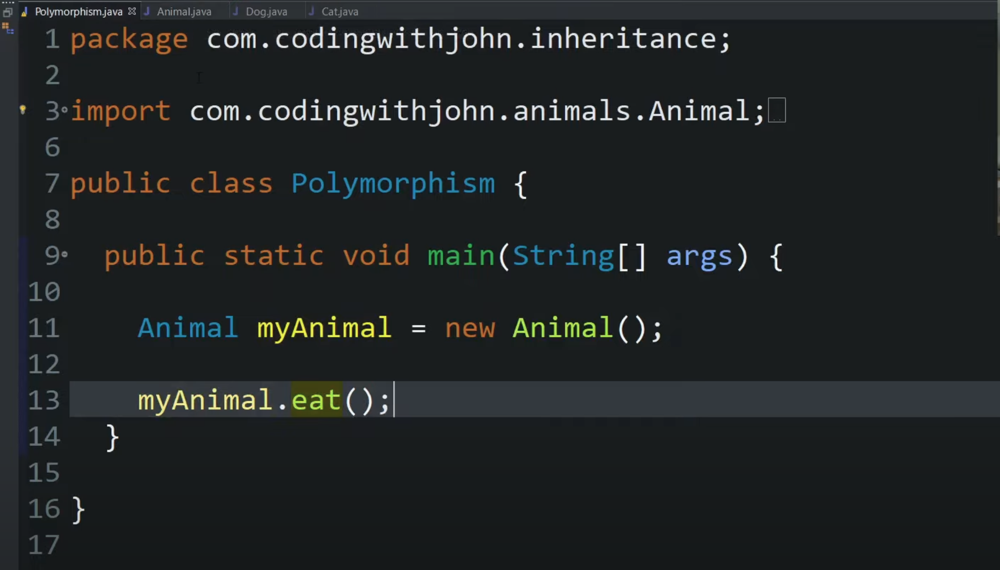
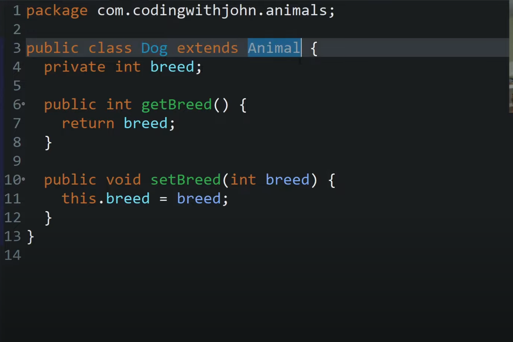
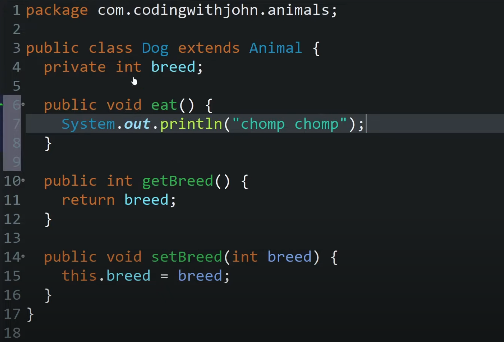
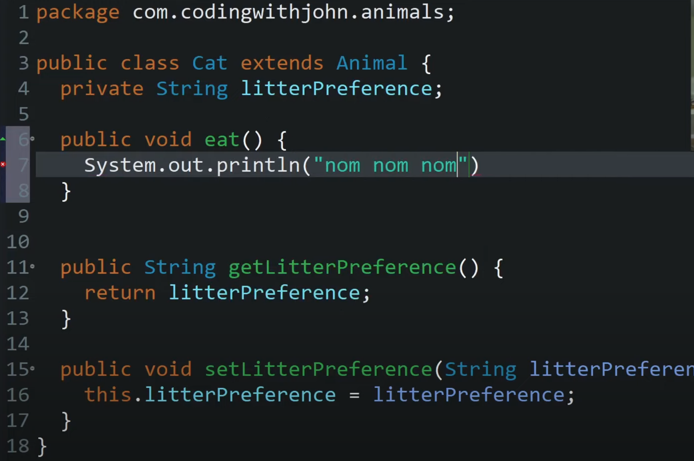
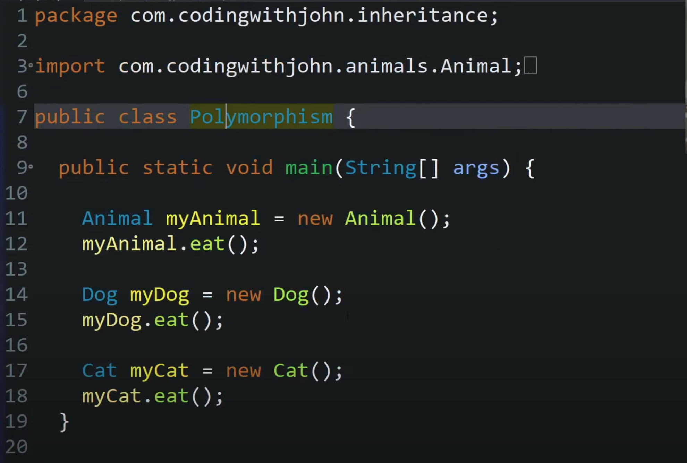
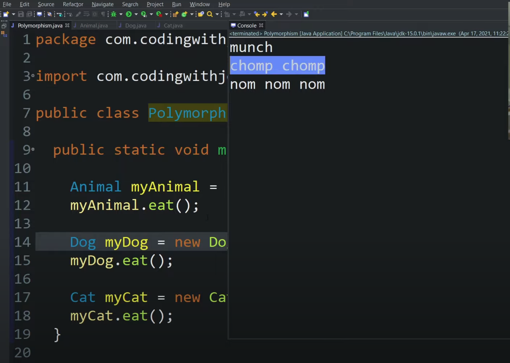
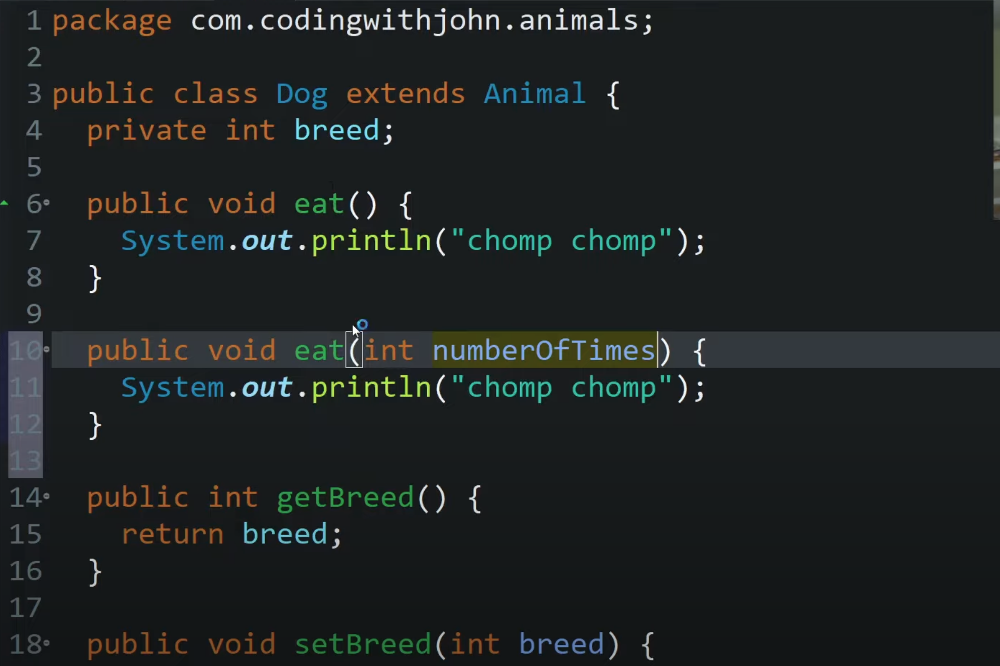

# Polymorphism

Polymorphism is a programming concept that allows objects of different types to be treated as if they are of the same type, based on a shared interface or inheritance relationship. 
In other words, it allows objects to take on many different forms or shapes.

## Example

In this example, we have an Animal class with an eat method. We then have two subclasses of Animal: Dog and Cat. 
Both of these classes override the eat method to do something different. 
Finally, we have a main method that calls the eat method on all three classes. The output shows that each class has its own implementation of the eat method.

### 1. Making an Animal class

### 2. Animal class is called in main() funciton with eat() method

### 3. Making the Dog class

### 4. Dog class extends Animal and overrides the eat() method

### 5. Cat class extends Animal and overrides the eat() method

### 6. main() method calls eat method of all three class instances

### 7. Three different outputs get printed

### 8. Dog can have two eat methods is they have different params (method overloading)

### Conclusion
In summary, polymorphism is a programming concept that allows objects of different types to be treated as if they are of the same type, based on a shared interface or inheritance relationship. It allows objects to take on many different forms or shapes. 
In Java, polymorphism is achieved through method overriding and method overloading.
