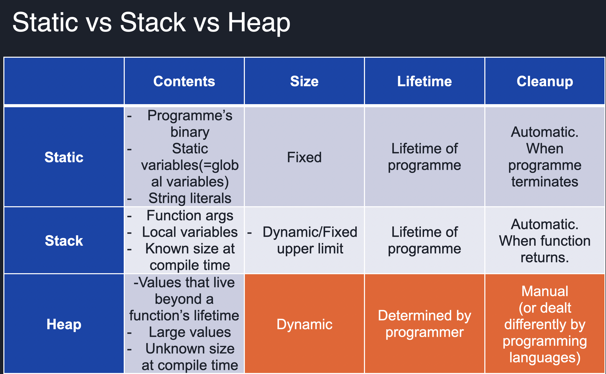
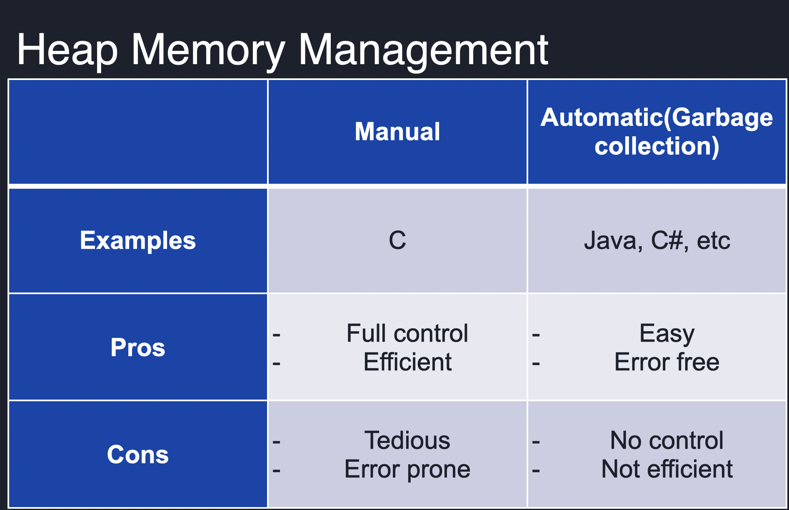

# Memory management
## Static vs stack vs heap
In a computer program, memory management refers to the process of allocating and deallocating memory to store and retrieve data. There are three main types of memory management: static, stack, and heap.

### Static Memory Management:
Static memory management is used to allocate memory to data that does not change during the lifetime of the program. This data is allocated during compile time and is stored in a special region of memory known as the data segment. Examples of static data include global variables and constants.

### Stack Memory Management:
Stack memory management is used to allocate memory to data that is local to a function and is created when the function is called. This data is stored in a special region of memory known as the stack. The stack is a last-in-first-out (LIFO) data structure, which means that the last data to be added to the stack is the first data to be removed from it. Examples of stack data include function parameters, local variables, and return addresses.

### Heap Memory Management:
Heap memory management is used to allocate memory to data that is dynamically created during the lifetime of the program. This data is stored in a region of memory known as the heap. Unlike the stack, the heap is a non-linear data structure, which means that data can be allocated and deallocated in any order. Examples of heap data include objects created with the new operator in Java or C++, and dynamic arrays.

